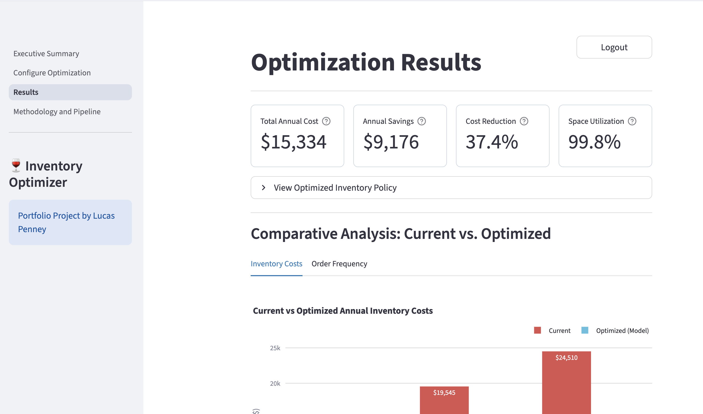
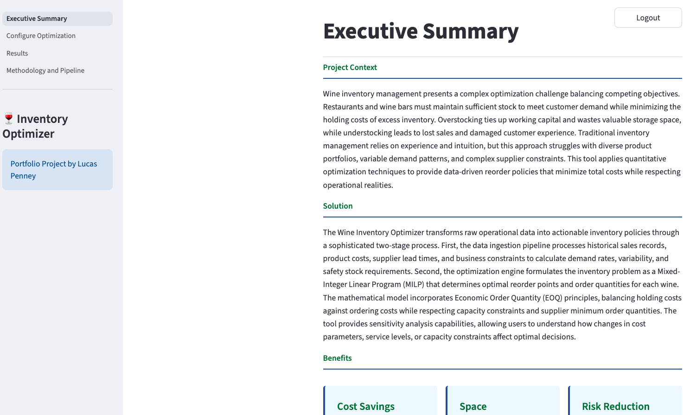
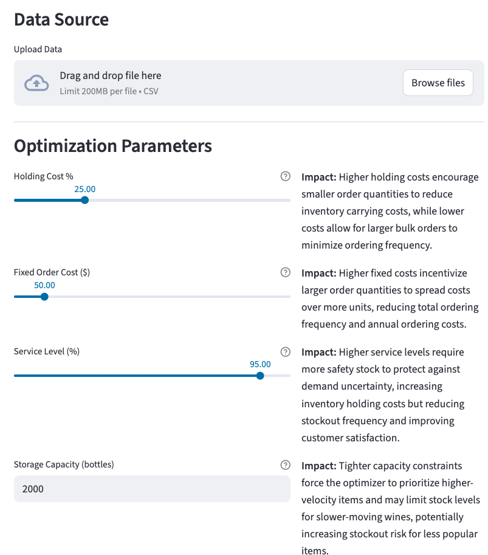
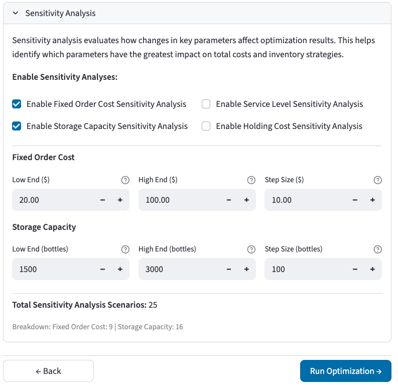
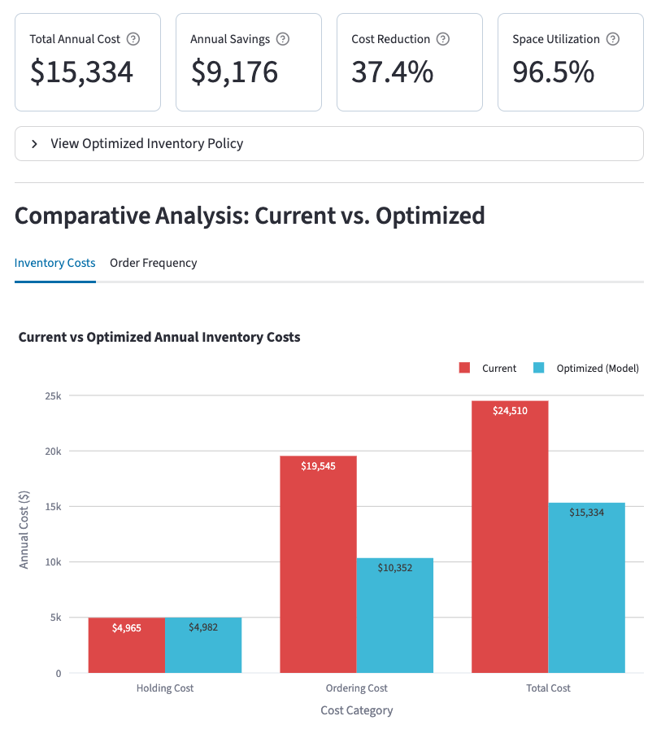
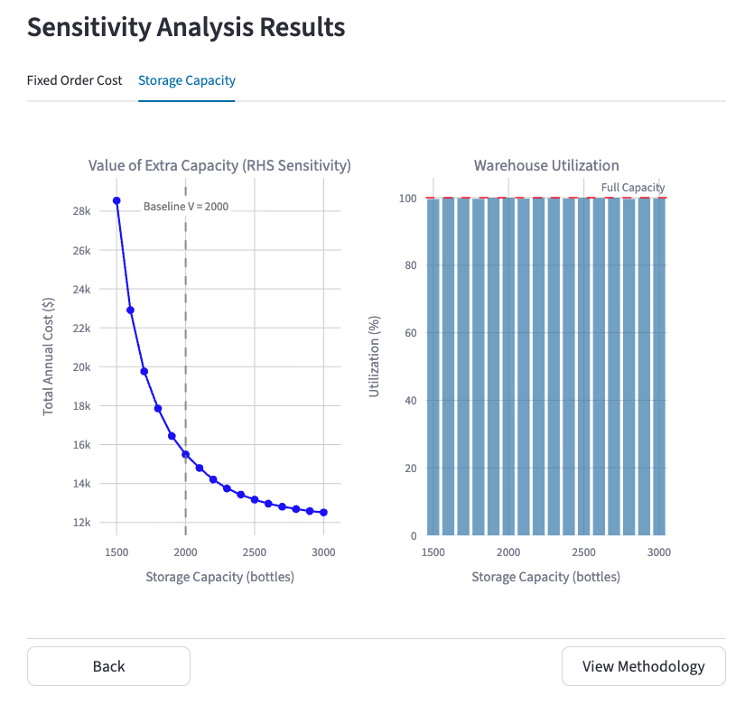
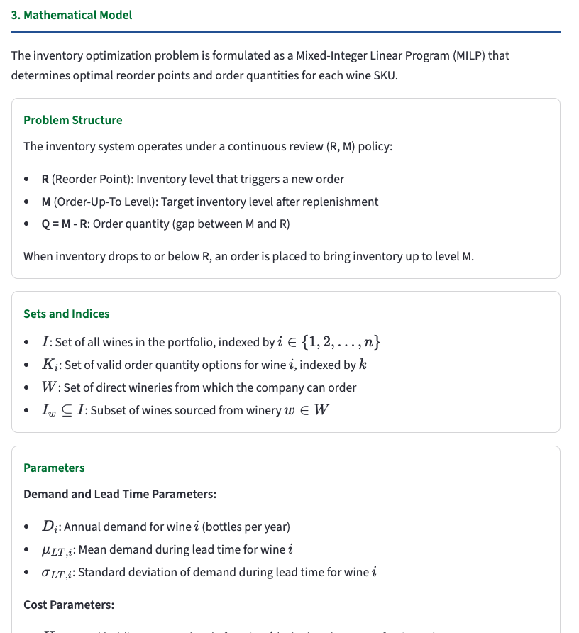

# Wine Inventory Optimizer

**Reduced wine inventory costs by 30-40% for a hospitality/tourism business using mixed-integer optimization.**

Built for a major tourism company that operates restaurants, this tool replaces gut-feel ordering with data-driven reorder policies — balancing the cost of holding inventory against the cost of placing orders, all within real-world storage and supplier constraints.

<p align="center">
  
</p>

> **Try it live:** [wine-inventory-optimizer.streamlit.app](https://wine-inventory-optimizer.streamlit.app)
---

## Key Results

- **30-40% reduction (~$9000)** in total annual inventory costs compared to the current ordering policy
- **$7/bottle** is the value of additional storage space, which plateaus around 2500 bottles
- **95% service level** maintained and 99.9% service level can be achieved with minimal extra cost
- **100% space utilization** to maximize the value per unit of storage space

---

## Why I Built This

This project started as a project for a graduate Decision Analytics class at McGill University, which was extended following course completion. I consulted with a former employer in the hospitality and tourism sector, who I knew had a keen interest in data and optimization. Their ordering process relied on experience and intuition, which resulted in frequent purchase orders and bloated administrative costs. I saw an opportunity to apply operations research techniques to a tangible, everyday business problem — and to build a tool the business could actually use, not just a report that sits on a shelf.

---

## How It Works

The optimizer follows a straightforward pipeline:

1. **Ingest** historical sales data, product costs, supplier lead times, and business rules
2. **Analyze** demand patterns to calculate how much safety stock each wine needs
3. **Generate** valid ordering options for each wine (respecting case sizes, supplier minimums, and by-the-bottle rules)
4. **Optimize** using a Mixed-Integer Linear Program (MILP) that finds the lowest-cost combination of reorder points and order quantities across the entire portfolio
5. **Visualize** results with interactive dashboards, cost comparisons, and sensitivity analysis
---

## App Walkthrough

### Executive Summary

The landing page provides project context, explains the business problem, and outlines the benefits of the optimization approach. Users can access the app as a guest (with anonymized demo data) or as the client (with real data).

<p align="center">
  
</p>

### Configure Optimization

Users set four key parameters before running the optimizer:
- **Holding Cost %** — how expensive it is to keep inventory on the shelf
- **Fixed Order Cost** — the administrative cost each time an order is placed
- **Service Level** — how much stockout risk is acceptable
- **Storage Capacity** — the physical limit on how many bottles can be stored

Optional sensitivity analysis can be enabled to explore how results change as these parameters vary.

<p align="center">
  
  
</p>


### Results Dashboard

After running the optimizer, the results page displays:
- **KPI cards** — total annual cost, dollar savings, percentage cost reduction, and space utilization
- **Cost comparison chart** — current policy vs. optimized policy (holding cost, ordering cost, total cost)
- **Order frequency analysis** — showing how the top cost-saving wines reduce their ordering frequency
- **Downloadable inventory policy** — an Excel file with optimized reorder points and order-up-to levels for every wine

<p align="center">
  
</p>

### Sensitivity Analysis

Interactive charts reveal how optimal costs shift when assumptions change. For example:
- How does total cost change as storage capacity increases? (And at what point does adding more space stop helping?)
- What happens to the holding vs. ordering cost trade-off as fixed order costs rise?
- How much extra safety stock does a 99% service level require compared to 90%?

<p align="center">
  
</p>

### Methodology & Pipeline

Full technical documentation is built into the app itself — including the ETL pipeline flowchart, the complete MILP formulation, business rules (winery minimums, anchor wine logic), and parameter explanations.

<p align="center">
  
  
</p>

---

## Tech Stack

| Technology | Role |
|---|---|
| **Python** | Data processing and optimization |
| **Streamlit** | Web UI |
| **PuLP (CBC)** | MILP solver |
| **Pandas & NumPy** | Data and numerics |
| **SciPy** | Safety-stock statistics |
| **Plotly & Matplotlib** | Charts and visualizations |

---

## Getting Started

### Prerequisites
- Python 3.8+
- pip

### Installation

```bash
git clone https://github.com/lucas-penney/inventory-optimizer.git
cd inventory-optimizer
pip install -r requirements.txt
```

### Run the App

```bash
streamlit run app.py
```

The app loads anonymized demo data by default — no setup required to explore the full optimization workflow.

---

## Project Structure

```
inventory_optimizer/
├── app.py                  # Streamlit entry point and navigation
├── requirements.txt        # Python dependencies
├── pages/
│   ├── dashboard.py        # Executive summary and access control
│   ├── solver_ui.py        # Parameter configuration and optimization runner
│   ├── results.py          # Results visualization and comparative analysis
│   └── methodology.py      # Technical documentation
├── src/
│   └── solver_logic.py     # MILP formulation, data prep, and sensitivity
├── scripts/
│   └── anonymizer.py       # Data anonymization for demo dataset
├── utils/
│   └── ui_components.py    # Reusable UI components and flowchart builder
├── data/
│   └── dummy_data.csv      # Anonymized demo dataset (~80 wines)
└── images/                 # App and README assets
```

---